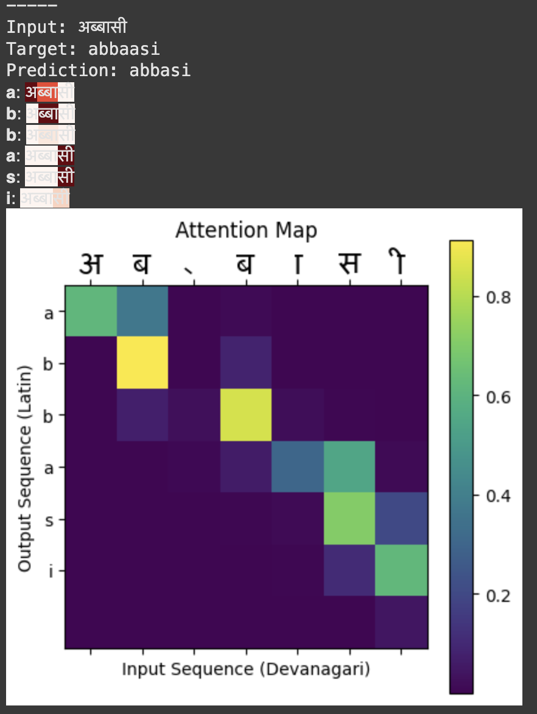

# [DA6401 Assignment 3](https://wandb.ai/sivasankar1234/DA6401/reports/Assignment-3--VmlldzoxMjM4MjYzMg)


This repository contains the implementation for **DA6401 Assignment 3**, it explores sequence-to-sequence (seq2seq) models for transliteration using the [Dakshina Dataset](https://github.com/google-research-datasets/dakshina). The primary goal is to map a Devanagari script to its corresponding word in romanized string (Latin script), leveraging RNN-based architectures and attention mechanisms. The assignment is structured to:

- Build and analyze vanilla seq2seq models (RNN, LSTM, GRU)
- Experiment with attention-based models
- Perform hyperparameter tuning using Weights & Biases (wandb)
- Visualize model internals and attention maps

`Humble Note`: I made the sweep based on character level accuracy, while reporting I have mentioned both sequence level accuracy(exact match) and character level accuracy in report.

- **Assignment Report**: [WandB Report](https://wandb.ai/da24s016-indian-institute-of-technology-madras/da6401-assignment3/reports/DA6401-Assignment-3-Report--VmlldzoxMjg0NDY3Mg)
- **GitHub Repository**: [aayushmanda/da6401_assignment3](https://github.com/aayushmanda/da6401_assignment3)
- **WandB Sweep Links**:
  - [Sweep Homepage Vanilla](https://wandb.ai/da24s016-indian-institute-of-technology-madras/da6401-assignment3_vanilla/sweeps/64v5oiu0?nw=nwuserda24s016)
  - [Sweep Homepage Attention](https://wandb.ai/da24s016-indian-institute-of-technology-madras/da6401-assignment3_attention/sweeps/9mw3okow?nw=nwuserda24s016)

---
## Usage
Please install the dataset before running any of the .py files (consider this as requirements)
```bash
wget https://storage.googleapis.com/gresearch/dakshina/dakshina_dataset_v1.0.tar
tar -xvf dakshina_dataset_v1.0.tar
pip install prettytable
```
Script is for training vanilla seq2seq model.

```bash
python train.py
```
## Attention and Activation map


## Dataset
The project uses the [**DakshinaDataset**](https://github.com/google-research-datasets/dakshina). Download and extract it as mentioned in github repo in link.

## Repo Structure

```
  da6401_assignment3/
   ├── predictions_attention/          # Directory containing prediction outputs for the attention-based model
   ├── predictions_vanilla/            # Directory containing prediction outputs for the vanilla Seq2Seq model
   ├── asg3.ipynb                      # Jupyter notebook for training and evaluating the vanilla Seq2Seq model
   ├── asg3_attention.ipynb            # Jupyter notebook for training and evaluating the attention-based Seq2Seq model
   ├── attention.pt                    # Saved model weights for the attention-based Seq2Seq model
   ├── best_transliteration_model.pt   # Saved model weights for the best vanilla Seq2Seq model
   ├── model.py                        # Definitions for EncoderRNN, DecoderRNN, and Seq2SeqModel (used by both models)
   ├── train.py                        # Script for training and evaluating the Seq2Seq models
   ├── utils.py                        # Utilities for data loading and preprocessing (e.g., TransliterationDataset, prepare_data)
   ├── README.md                       # Project overview, setup instructions, and dataset details

```